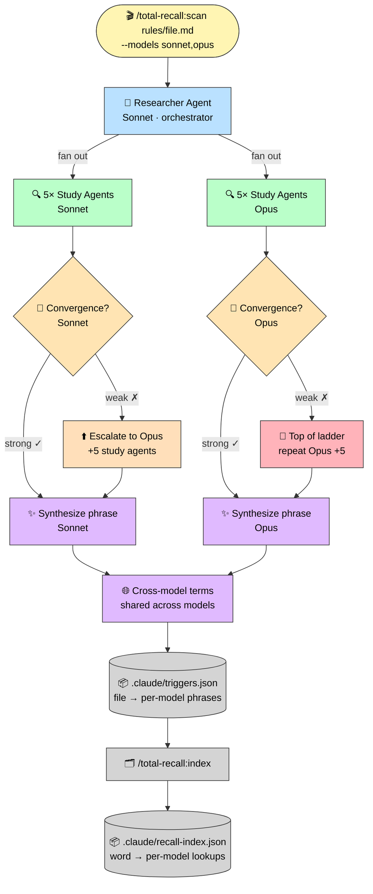
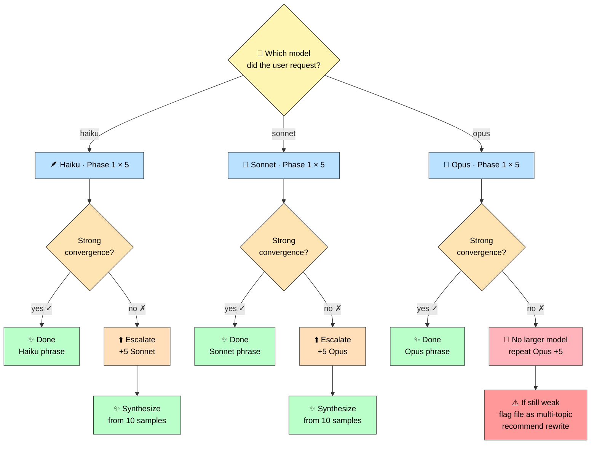

# Architecture

Internal layout of the total-recall plugin: agents, skills, rules, and storage formats.

## Pipeline



## Agents

| Agent | Model | Role |
|-------|-------|------|
| **researcher** | Sonnet | Orchestrates model-aware two-phase sampling, per-model convergence, cross-model analysis |
| **study** | Haiku (default; overridden per-call) | Reads a single file and returns a 1-6 word phrase |
| **compare-researcher** | Sonnet | Runs haiku/sonnet/opus comparison for research purposes |

## Skills

| Skill | Description |
|-------|-------------|
| **scan** | Resolve file/directory input, invoke researcher with `--models`, store model-scoped results |
| **seed** | Auto-discover documentation and prompt files, batch-scan with model targeting |
| **index** | Build per-model reverse lookup (word → files + phrase) from triggers.json |
| **list** | Display stored triggers with optional filtering |
| **write** | Write trigger phrases from triggers.json into file frontmatter |
| **schedule** | Discover frontmatter triggers and create CronCreate jobs for periodic re-injection |
| **forget** | Remove triggers for a file or glob pattern |
| **compare** | Cross-model comparison research tool |

## Rules

| Rule | Description |
|------|-------------|
| **recall-index** | Instructs agents to check `.claude/recall-index.json` before re-reading files, using their own model's triggers |

## Two-Phase Sampling with Model Escalation

Phase 1 runs 5 agents at the target model. If convergence is weak, Phase 2 **escalates to a larger model** instead of repeating. Only at the top of the ladder (Opus) does Phase 2 fall back to repetition — and persistent weak convergence there is a signal that the file itself is multi-topic and needs rewriting.



Cross-model data showed the problem usually isn't sample size — it's model capability. Escalating one rung up almost always converges where repetition wouldn't.

## Storage

### `.claude/triggers.json` (v2, model-scoped)

Master trigger database. One entry per file, one phrase per (file, model).

```json
{
  "version": 2,
  "triggers": {
    "rules/broken-windows.md": {
      "models": {
        "sonnet": {
          "phrase": "broken windows code quality ratchet",
          "samples": ["broken windows enforcement", "code quality ratchet rule", "..."],
          "convergence": ["broken", "windows", "ratchet"],
          "confidence": 0.98,
          "phases": 1
        },
        "opus": {
          "phrase": "broken windows codebase quality ratchet",
          "samples": ["..."],
          "convergence": ["broken", "windows", "codebase", "quality", "ratchet"],
          "confidence": 0.99,
          "phases": 1
        }
      },
      "crossModelTerms": ["broken", "windows", "quality", "ratchet"],
      "scannedAt": "2026-04-01T10:00:00.000Z"
    }
  }
}
```

Keys are relative paths from the project root. Re-running `/total-recall:scan` for additional models merges into the existing `models` object — does not overwrite other models' entries.

### `.claude/recall-index.json` (v2, model-aware)

Reverse lookup built by `/total-recall:index`. Maps individual words back to the files they came from, with per-model phrasing so an agent can find the trigger optimized for its own model.

```json
{
  "version": 2,
  "builtAt": "2026-04-01T10:05:00.000Z",
  "triggerCount": 15,
  "models": {
    "sonnet": {
      "ratchet": {
        "files": ["rules/broken-windows.md"],
        "phrase": "broken windows code quality ratchet",
        "weight": 0.95
      }
    },
    "opus": {
      "ratchet": {
        "files": ["rules/broken-windows.md"],
        "phrase": "broken windows codebase quality ratchet",
        "weight": 0.98
      }
    }
  },
  "crossModel": {
    "ratchet": { "files": ["rules/broken-windows.md"], "weight": 0.95 }
  }
}
```

Words with weight below 0.2 are pruned (too generic to be useful). Common stop words are removed entirely.

### Per-file frontmatter (set by `/total-recall:write`)

A file's YAML frontmatter is enriched with model-scoped trigger phrases so they travel with the file:

```yaml
---
name: broken-windows
description: "Quality ratchet rule"
trigger_phrase:
  haiku:  "no broken windows"
  sonnet: "quality ratchet broken windows"
  opus:   "broken windows codebase quality ratchet"
refresh: 15m
---
```

This is what `/total-recall:schedule` reads to decide which files are eligible for periodic re-injection.

### `.claude/compare-results.json` (research output, not consumed)

`/total-recall:compare` writes here. Schema is documented in `skills/compare/SKILL.md`. No other skill reads this file — it exists purely for research and manual inspection.

## Storage drift

Two storage systems (master JSON + per-file frontmatter) are not auto-synced after a re-scan. If you re-scan a file but forget to re-run `/total-recall:write`, the frontmatter (and therefore the schedule's injection content) is stale. A future `/total-recall:check` skill will surface this; for now, treat re-scan as a two-step (scan → write) operation.

## Cost model

One-time per file per model, amortized across all future sessions:

- 5 study agent calls per file **per target model** (e.g., `--models sonnet,opus` = 10 calls/file)
- 1 Sonnet researcher call per batch (up to 20 files)
- Model escalation (Phase 2) adds 5 calls only when convergence is weak
- Triggers for universal engineering concepts are portable across projects (within the same model)

## See also

- [skills/scan/SKILL.md](../skills/scan/SKILL.md) — scan implementation spec
- [agents/researcher.md](../agents/researcher.md) — researcher orchestration spec
- [agents/study.md](../agents/study.md) — sampling-agent spec
- [docs/SCHEDULING.md](SCHEDULING.md) — schedule mechanism deep dive
- [docs/research/](research/) — feasibility analysis, test cases, cross-model results
